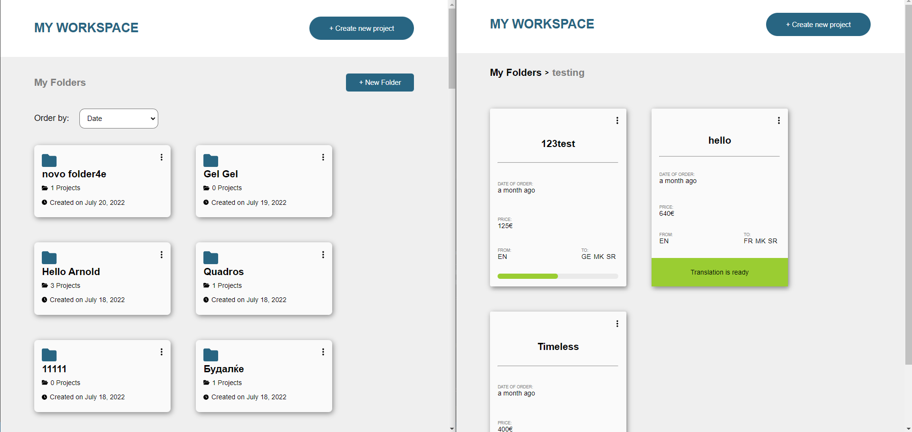

# Dashbord - Organizing Files :card_index_dividers:	

## Table of contents

- [Overview](#overview)
  - [Screenshot](#screenshot)
  - [Description](#users-are-able-to)
- [My process](#my-process)
  - [Built with](#built-with)
- [Project setup](#project-setup)
- [Author](#author)

## Overview

### Screenshot



#### Users are able to:

* Create a folder
* Create a project
* Add and remove projects to and from folders 
* Sort folders by Date or by a number of Projects

## My process

### Built With
- HTML5
- CSS
- Flexbox
- CSS Grid
- SASS (SCSS)
- JavaScript
- Axios
- Vue 3
- Vue Router
- Vuex
```
Disclamer:
- some things are not done in a proper way because of the limitation of the JSON server
```

## Project setup
```
yarn install
```
### Compiles and hot-reloads for development
```
yarn serve
```

### Install JSON server for a quick back-end mock
```
npm install -g json-server
```
### Start the JSON server
```
json-server --watch database/db.json
```
## Author

- LinkedIn - [@Marko](https://www.linkedin.com/in/marko-hristovski-77b9a6149/)


